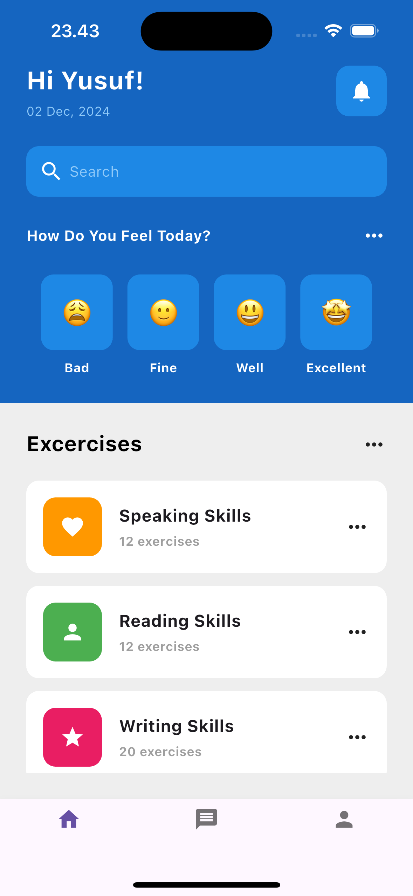

# Dribbble App Clone

This is a Flutter project that replicates a UI design inspired by Dribbble. The app includes a beautiful and modern UI featuring a dashboard with mood selection and skill exercises.

## Features

- Dynamic greeting with the user's name and current date.
- Mood selection buttons with emojis and labels.
- List of skill exercises with icons and descriptions.
- Bottom navigation bar for easy navigation.

---

## Preview



---

## How to Run the Project

1. Clone the repository:
   ```bash
   git clone https://github.com/YusufFauziyan/flutter-dribble-clone.git
   ```
2. Open main.dart and start debug
3. Bismillah
